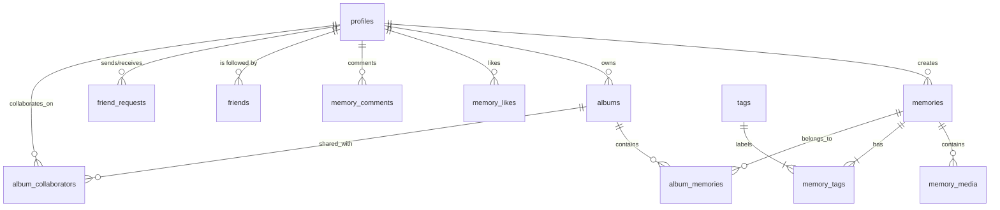

# MemoryLane Supabase Database Schema Documentation

This document outlines the database architecture for the MemoryLane application, detailing the tables, relationships, and design principles used to maintain data integrity and normalization.

## 1. Core Architecture Overview

MemoryLane uses **Supabase (PostgreSQL)** to manage user authentication, profile data, memories, media, social connections, and community interactions. 

### Design Principles:
- **Normalization:** Data is separated into logical entities to avoid redundancy (e.g., tags are stored in a central table and linked via a junction table).
- **Referential Integrity:** Foreign keys are used across all tables to ensure child records cannot orphaned and parent data remains consistent.
- **Scalability:** UUIDs are used as primary keys instead of serial integers to avoid ID collision and simplify future potential horizontal scaling.

---

## 2. Table Schemas & Models

### `profiles`
Extends Supabase `auth.users` with application-specific metadata.
| Column | Type | Description |
| :--- | :--- | :--- |
| `id` | `uuid` (PK) | Corresponds to `auth.users.id` |
| `username` | `text` (Unique) | User's unique handle |
| `full_name` | `text` | Display name |
| `avatar_url` | `text` | Link to user's profile image |
| `created_at` | `timestamptz` | Account creation timestamp |

### `memories`
The primary entity representing a "Moment" or "Memory".
| Column | Type | Description |
| :--- | :--- | :--- |
| `id` | `uuid` (PK) | Unique memory ID |
| `user_id` | `uuid` (FK) | References `profiles.id` |
| `title` | `text` | Title of the memory |
| `description` | `text` | Detailed story text |
| `memory_date` | `date` | When the event occurred |
| `location` | `text` | Descriptive location string |
| `latitude/longitude` | `double` | Geo-coordinates |
| `visibility` | `varchar` | `'private'`, `'friends'`, or `'public'` |
| `is_milestone` | `bool` | High-priority indicator |
| `is_public` | `bool` | (Legacy) Mapped to `visibility === 'public'` |

### `memory_media`
One-to-many relationship with `memories`.
| Column | Type | Description |
| :--- | :--- | :--- |
| `id` | `uuid` (PK) | Unique media entry |
| `memory_id` | `uuid` (FK) | References `memories.id` |
| `media_url` | `text` | Cloudinary storage URL |
| `media_type` | `text` | `'image'`, `'video'`, or `'audio'` |

### `tags` & `memory_tags`
Many-to-many relationship for categorizing memories.
- **`tags`**: Stores unique tag names (e.g., "Family", "Travel").
- **`memory_tags`**: Junction table linking `memories` and `tags`.

### `albums` & `album_memories`
Groups memories into collections.
- **`albums`**: Stores album metadata and `user_id` owner.
- **`album_memories`**: Junction table linking `albums` to `memories`.

### `album_collaborators`
Manages shared album access.
| Column | Type | Description |
| :--- | :--- | :--- |
| `album_id` | `uuid` (FK) | References `albums.id` |
| `user_id` | `uuid` (FK) | References `profiles.id` |
| `role` | `text` | `'owner'`, `'contributor'`, or `'viewer'` |

### `friends` & `friend_requests`
Social graph management.
- **`friend_requests`**: Tracks `'pending'`, `'accepted'`, or `'rejected'` states between a sender and recipient.
- **`friends`**: Stores established bidirectional connections.

### `memory_likes` & `memory_comments`
Community interaction models.
- **`memory_likes`**: Tracks user likes per memory.
- **`memory_comments`**: Stores text responses linked to a memory and a user profile.

---

## 3. Relationships Diagram (Mermaid)

## 4. Constraint Policies (RLS)
While Row Level Security (RLS) can be toggled per table, the application currently enforces security at the **Middleware/API Layer** via the following logic:
1. **Ownership**: Users can only update/delete memories where `user_id` matches their auth ID.
2. **Privacy**: "Private" memories are filtered out by API queries unless the requester is the owner.
3. **Social Circle**: "Friends Only" memories are only returned in feeds if a record exists in the `friends` table for both the viewer and the creator.
4. **Public Access**: "Public" memories are accessible via the `adminSupabase` client for the Community Stream.
