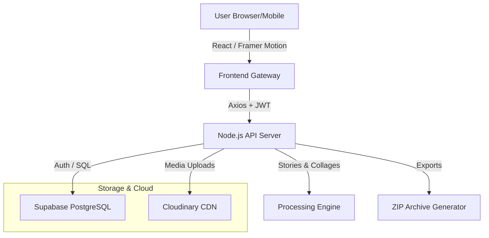

# MemoryLane 📸 | Life's Premium Digital Time Capsule

MemoryLane is a sophisticated, full-stack application designed to preserve, organize, and share life's most precious moments with unparalleled elegance and privacy. Built for those who value both high-end aesthetics and data sovereignty.

---

## 🔗 Project Ecosystem

| Resource | Link |
| :--- | :--- |
| **🚀 Live Demo** | [https://memory-lane-personal-phi.vercel.app/](https://memory-lane-personal-phi.vercel.app/) |
| **🎥 Video Walkthrough** | [Google Drive Walkthrough](https://drive.google.com/file/d/1bGCeQwjSs8WGnQ7oiTcPbq8ExmYGToiy/view?usp=sharing) |
| **⚙️ Backend API** | https://memorylane-personal.onrender.com |
| **📑 Documentation** | [Database Schema](./DATABASE_SCHEMA.md) |

---

## 🌟 Core Highlights

### 🎞️ The Storytelling Engine
- **High-Fidelity Capture:** Support for 4K Photos, HD Videos, and High-Fidelity Voice Notes.
- **Stories & Highlights:** Automatically compile your memories into nostalgic highlight reels and interactive digital stories.
- **Reminisce Search:** Powerful filtering to relive memories from specific dates, milestones, or mood-based tags.
- **Interactive Timeline:** A fluidly animated, chronological feed of your life journey powered by Framer Motion.

### 🔒 Privacy & Sovereignty
- **Granular Controls:** Choose between *Private*, *Friends Only*, or *Public* visibility for every memory.
- **Collage Master:** Generate and download high-resolution JPEG collages of your favorite memories instantly.
- **Data Export:** Instantly package your entire history—including all high-res media—into a secure ZIP archive.
- **Security-First Architecture:** Protected by Supabase Auth, JWT middleware, and account-level privacy controls.

### 👥 Social & Collaboration
- **Collaborative Albums:** Create shared spaces where friends can contribute to a single themed collection with advanced invitation management.
- **Validated Connections:** Build a trusted social circle through a secure follower/friend system.
- **Community Stream:** Discover and interact with public milestones through a responsive, visual grid layout.

---

## 🛠️ Professional Tech Stack

### Frontend (Mobile-First Reactive UI)
- **Framework:** React 18 with Vite for lightning-fast HMR.
- **Styling:** Tailwind CSS with a custom **Glassmorphism** design system.
- **Animations:** Framer Motion for premium micro-interactions and transitions.
- **Icons:** Lucide React for consistent, high-end iconography.
- **State Management:** React Context API & Axios Interceptors.

### Backend (Scalable Service Layer)
- **Runtime:** Node.js & Express.js (ES Modules).
- **Security:** JWT Auth, Helmet.js, Express Rate Limit, and Joi Validation.
- **Media Engine:** Cloudinary API for optimized image/video transformation and delivery.
- **Collage Engine:** Canvas-based dynamic image generation for premium downloads.
- **Architecture:** Controller-Service-Route pattern with robust error handling.

### Infrastructure & Database
- **Database:** Supabase (PostgreSQL) with a highly normalized relational schema.
- **Storage:** Cloudinary (Multimedia) & Supabase Storage.
- **Deployment:** Netlify (Frontend CI/CD) & Render (Backend).

---

## 🏗️ System Architecture



---

## 🚀 Getting Started

### Prerequisites
- Node.js (v18+)
- Supabase Account (PostgreSQL + Auth)
- Cloudinary Account (Media Delivery)

### Quick Setup

1. **Clone the repository:**
   ```bash
   git clone https://github.com/khalida-thummala/MemoryLane_Personal.git
   ```

2. **Setup Backend:**
   - Navigate to `/backend`
   - Install dependencies: `npm install`
   - Configure `.env` (see `.env.example`)
   - Run: `npm run dev`

3. **Setup Frontend:**
   - Navigate to `/frontend`
   - Install dependencies: `npm install`
   - Configure `.env` (see `VITE_API_URL`)
   - Run: `npm run dev`

---

## 🔑 Test Account
> [!NOTE]
> Use these credentials to explore the premium features instantly.
- **Email:** `testuser@example.com`
- **Password:** `123456`

---

*Capture the sights, sounds, and feelings of right now—forever.*
